🗺️ **Voir la Roadmap du projet :** [ROADMAP.md](ROADMAP.md)

# 🚀 DIYXMR — Stack de Minage Monero par CPU


[](https://archive.softwareheritage.org/swh:1:rev:2d8d5ad926f4a3036a9c046bcfbc973fa16d9842;origin=https://github.com/DIYBYPASS/DIYXMR)


DIYXMR est un stack de minage Monero (XMR) clé en main pour Linux. Conçu pour la performance et la résilience, il automatise le déploiement, l'optimisation système (CPU/RAM), la sécurité réseau (Cloudflare DoT/UFW) et gère nativement le Merge Mining avec Tari sans configuration complexe.

Tout est piloté via un **Tableau de Bord (TUI)** interactif en temps réel.

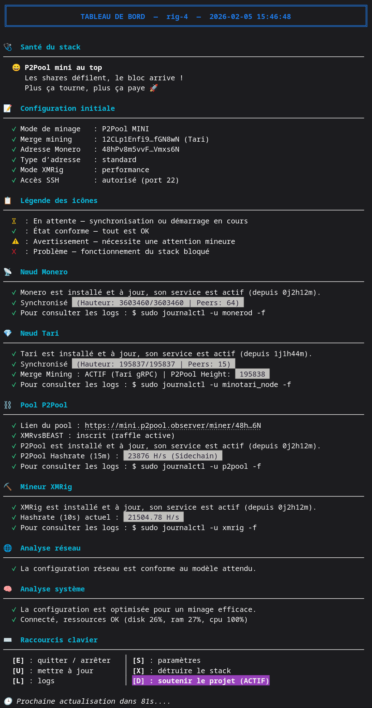

---

## ⚠️ Philosophie : Performance & Anti-Censure
Ce projet est conçu pour la **performance brute** et la **résilience**, pas pour l'anonymat.
- **Cloudflare DoT = Anti-Censure :** Utilisation de serveurs DNS chiffrés (DNS over TLS via Cloudflare) pour garantir la découverte des pairs (Peer Discovery) **même en cas de blocage ou de filtrage par le FAI**, sans perte de vitesse.
- **Clearweb = Transport :** Le trafic de minage transite en direct sur Internet (TCP pur, bypass Tor) pour garantir une **latence minimale**. 

## 🏁 La Règle d'Or : Latence > Hashrate
Le minage est une course de vitesse, pas seulement de puissance.
Il ne suffit pas de trouver la solution, il faut **être le premier** à la transmettre. Si votre réseau est ralenti par une **connexion internet lente ou une mauvaise configuration**, un autre mineur validera le bloc quelques millisecondes avant vous.

**Résultat :** Votre bloc est rejeté (Orphelin) et vous avez brûlé de l'électricité pour zéro récompense.

## 🛑 OpSec : Séparez vos usages
Il est impossible d'avoir un stack à la fois **anonyme** (lent) et **performant** (rapide) pour le minage.
Ce script transforme votre machine en serveur de minage dédié : **ne l'utilisez pas comme portefeuille ni comme nœud privé**.

Gardez à l'esprit cette séparation stricte :
- **Le minage** nécessite d'allier sécurité et performance brute.
- **Vos transactions** nécessitent d'allier sécurité et anonymat absolu.

---

## ✨ Fonctionnalités Principales

### 🏗️ Architecture & Composants de Minage
- **Monero Node (`monerod`)** : Déploiement d'un nœud complet en mode **Pruned** (~70 Go) pour optimiser l'espace disque tout en renforçant le réseau.
- **P2Pool** : Intégration de la sidechain décentralisée avec choix du réseau (**NANO**, **MINI** ou **FULL**) pour un minage sans frais et des paiements directs.
- **XMRig** : Installation et configuration automatisée du mineur CPU haute performance.
- **Merge Mining Tari** : Gestion native de **Minotari** permettant de miner du Tari en parallèle du Monero sans aucune perte de hashrate.
- **Support MoneroOcean** : Option de minage via pool centralisé avec algorithme de *switching* automatique.

### ⚡ Optimisations de Performance (Hardware & Réseau)
- **HugePages & 1GB Pages** : Activation automatique et persistante au redémarrage pour maximiser l'efficacité de l'algorithme RandomX.
- **Désactivation du THP** : Gestion des *Transparent Huge Pages* via un service Systemd dédié pour éliminer les latences CPU.
- **Auto-tuning CPU** : Détection du cache L3 et calcul intelligent du nombre de threads optimal, incluant le support des processeurs AMD 3D V-Cache.
- **TCP BBR & FQ** : Activation de l'algorithme de congestion BBR et de la file d'attente *Fair Queuing* pour minimiser la latence de transmission des *shares*.

### 🛡️ Sécurité & Confidentialité (Hardening)
- **Pare-feu Adaptatif (UFW)** : Configuration automatique restreignant l'accès aux seuls ports nécessaires selon le mode de minage et les options activées.
- **Gestion Intelligente du SSH** : Le script détecte automatiquement votre port SSH actuel pour éviter de vous bloquer l'accès lors de la configuration de l'UFW, et permet de le modifier ou de le bannir totalement pour plus de sécurité.
- **Anti Brute-force (Fail2Ban)** : Sécurisation automatisée des accès SSH contre les tentatives d'intrusion par force brute.
- **Anti-Censure via Cloudflare (DoT)** : Chiffrement des requêtes DNS (DNS over TLS via 1.1.1.1) pour contourner les restrictions des FAI et empêcher l'espionnage de la résolution des nœuds, le tout mis en cache localement.
- **Vérification Cryptographique** : Validation systématique de l'intégrité des binaires par sommes de contrôle **SHA256** et vérification des signatures **GPG**.
- **IPv6 Privacy Extensions** : Activation de la confidentialité IPv6 pour masquer l'identifiant matériel lors des communications réseau.

### ⚙️ Automatisation & Système (Systemd)
- **Création Automatique des Services** : Génération automatique des unités Systemd pour assurer le lancement au démarrage de `monerod`, `p2pool`, `xmrig` et `minotari_node`.
- **Redémarrage Automatique** : Configuration des services pour s'auto-relancer systématiquement en cas d'échec ou après une coupure.
- **Priorisation Kernel** : Attribution d'une priorité CPU maximale (`Nice=-20`) pour le processus du mineur XMRig.
- **Protections Système** : Ajustement de l'`OOMScoreAdjust` à -1000 et augmentation des limites de fichiers ouverts (`NoFile`) à 65536 pour garantir la stabilité des nœuds.

### 🖥️ Interface & Gestion Utilisateur
- **Dashboard TUI (Text User Interface)** : Tableau de bord interactif affichant le hashrate, l'état de synchronisation, la santé système et les logs en temps réel.
- **Intégration Raffle XMRvsBEAST** : Le dashboard vérifie automatiquement via API si votre adresse est inscrite au programme de bonus XMRvsBEAST (raffle) pour augmenter votre hashrate gratuitement.
- **Assistant de Configuration (Wizard)** : Formulaire interactif guidé au premier lancement pour paramétrer les adresses de portefeuille et les accès réseau.
- **Gestion des Logs** : Rétention limitée à 24h avec purge automatique (`vacuum`) pour préserver l'espace de stockage.
- **Mise à jour Intégrée** : Système de mise à jour automatique pour le script et les binaires tiers directement depuis l'interface.

### 🛠️ Maintenance & Diagnostic
- **Mode "Spec Mining"** : Option permettant d'arrêter et de désactiver proprement tous les services pour libérer les ressources, tout en restant prêt à repartir.
- **Vérification des Flux** : Diagnostic interne confirmant la bonne liaison de données entre les différents composants (ex: XMRig ➜ P2Pool ➜ Monerod).
- **Nettoyage en Profondeur** : Fonction de désinstallation complète capable de supprimer binaires, services, blockchains et configurations réseau.
- **Synchronisation NTP** : Vérification et forçage de la synchronisation temporelle via `systemd-timesyncd`, cruciale pour la validation des blocs.

---

## 📊 Modes de Minage

### 🐝 P2Pool NANO
Sidechain très légère, conçue pour petits CPU.
- ✅ Pool décentralisé
- ✅ Pas de frais
- ✅ Paiements fréquents
- ❌ Plus de variance (récompenses plus irrégulières)
- 💡 **Idéal pour :** Petit CPU (Intel Atom / i3, AMD Ryzen 3 / 5, Raspberry Pi)

### 🐝 P2Pool MINI
Équilibre entre fréquence de paiements et stabilité des récompenses.
- ✅ Pool décentralisé
- ✅ Pas de frais
- ✅ Moins de variance que NANO
- ❌ Moins de paiements fréquents que NANO
- 💡 **Idéal pour :** CPU desktop (AMD Ryzen 7 / 9, Intel i5 / i7)

### 🐝 P2Pool FULL
Chaîne complète P2Pool pour gros CPU multithreads.
- ✅ Pool décentralisé
- ✅ Pas de frais
- ✅ Récompenses plus stables (moins de variance)
- ❌ Paiements moins fréquents que MINI/NANO
- 💡 **Idéal pour :** CPU serveur (AMD Threadripper, Intel i9, AMD EPYC, Intel Xeon)

### 🎯 SOLO
Minez directement avec votre nœud personnel.
- ✅ Décentralisé à 100 %
- ✅ Pas de frais
- ❌ Blocs rares, tout ou rien
- 💡 **Idéal pour :** Fermes de gros CPU

### 🌊 MoneroOcean
Pool centralisé avec switching automatique.
- ✅ Interface simple
- ✅ Switching RandomX/Rx/Cn
- ✅ Taux de change natif
- ❌ Pool centralisé
- 💡 **Idéal pour :** Simplicité, moins de bande passante

---

## 📈 Modes XMRig

### 🌿 ÉCO
Mode silencieux et optimisé pour un usage quotidien.
- ✅ 50% des threads activés
- ✅ Consommation électrique minimale
- ✅ Température réduite
- ✅ Ventilateurs silencieux
- ❌ Hashrate réduit de moitié
- 💡 **X3D :** Privilégie les cœurs avec V-Cache 3D pour maximiser l'efficacité RandomX

### ⚡ PERF
Mode performance maximale pour exploiter tout le potentiel du CPU.

- ✅ 100% des threads disponibles
- ✅ Hashrate maximal
- ❌ Consommation électrique élevée
- ❌ Température CPU élevée
- ❌ Ventilateurs bruyants
- 💡 **Astuce :** idéal en hiver pour chauffer la maison

---

## 📋 Configuration Requise

### Environnement : Bare Metal & Réseau Local
Pour garantir une **stabilité absolue** et une **efficacité maximale**, ce script est exclusivement conçu pour un usage sur machine physique et réseau filaire.

- **Bare Metal Uniquement (Pas de VM/VPS) :** Le minage RandomX nécessite un accès direct et exclusif aux registres MSR du processeur et une gestion spécifique de la mémoire (1GB Pages). L'utilisation d'une Machine Virtuelle (VM), d'un VPS ou d'un conteneur Docker ajoute une couche d'abstraction qui dégrade le hashrate et empêche les optimisations de bas niveau du noyau Linux effectuées par le script.
- **Réseau Local (LAN) & Ethernet :** La stabilité du P2Pool repose sur la réactivité de votre nœud. Une connexion Wi-Fi ou un réseau instable provoque des micro-coupures et augmente la latence, entraînant des shares rejetées (Stale shares). Le script optimise la pile TCP (BBR/FQ) pour le local afin de garantir que votre travail soit transmis instantanément au réseau.

### J’ai développé et optimisé le script pour :
- **OS :** Ubuntu Server 24.04 LTS (x64)
- **Stockage :** SSD NVMe 500 Go recommandé pour les nœuds (HDD et SSD SATA déconseillé)
- **RAM :** 8 Go minimum (Mode Dual Channel fortement recommandé pour le hashrate)
- **Réseau :** Fibre optique via Câble Ethernet (Wi-Fi déconseillé pour P2Pool)

### Pour recevoir vos récompenses :
- Une adresse Monero (obligatoire)
- Une adresse Tari (facultatif)

### 3 points très importants à comprendre :
- Pour recevoir vos récompenses de minage, **utilisez des portefeuilles dédiés au minage** (c’est une question de confidentialité).
- Vos portefeuilles **ne doivent pas être stockés sur votre RIG** (c’est une question de sécurité).
- Pour Monero, vous devez impérativement utiliser **l’adresse principale (“Primary address”)** de votre portefeuille, car c’est la seule compatible avec P2Pool.

---

## 🚀 Installation Rapide

Ce script doit être exécuté en tant que **root**.

```bash
# 1. Télécharger le script
wget https://raw.githubusercontent.com/DIYBYPASS/DIYXMR/main/diyxmr.sh

# 2. Le rendre exécutable
chmod +x diyxmr.sh

# 3. L'exécuter (en root)
sudo ./diyxmr.sh
```

---

## 🤔  Conseil pour le Spec Mining

Pour ceux qui font du Spec Mining (j’en fais partie), dans le TUI, appuyez sur la touche **E**, puis choisissez l’option **3**.
Cela **arrête et désactive** tous les services du stack sans rien supprimer. Vous pourrez alors miner d’autres projets à côté avec 100 % de vos ressources.

Quand le Spec Mining est plus calme, relancez simplement le script : il va analyser votre système et **tout remettre en route automatiquement** (services, firewall, etc.).

Mieux encore : **dédiez un SSD NVMe chiffré** exclusivement à votre stack Monero. Le spec mining impliquant souvent d'exécuter des logiciels non vérifiés, le risque d'infecter son disque avec des malwares est élevé. En utilisant deux SSD distincts (par exemple, un de 500 Go pour Monero et un autre de 500 Go pour le spec mining), vous isolez physiquement vos environnements. Dès que le spec mining devient moins intéressant, il vous suffit de *rebooter* votre rig sur le disque Monero, sain et sécurisé.

Dans une France, une Europe et un monde où les gouvernements deviennent **de plus en plus autoritaires** et où les libertés reculent, **le XMR a un bel avenir devant lui**.

---

## ❓ La foire aux questions

### Q : Pourquoi le Monero ?
R : Véritable cash numérique, Monero est privé, fongible et accessible via un simple processeur. En adaptant constamment son algorithme pour neutraliser les ASICs et contrer les projets comme Qubic qui tentent de centraliser le hashrate, Monero reste techniquement plus fidèle à la philosophie originelle de Satoshi Nakamoto (« un CPU, un vote ») que le Bitcoin actuel.  Épaulé par P2Pool pour empêcher les attaques à 51 % et par Haveno pour garantir la souveraineté des échanges, il s'impose comme l'unique monnaie de résistance réellement décentralisée.

### Q : Pourquoi P2Pool ?
R : Lancé en 2021 par SChernykh, P2Pool est né pour contrer la centralisation des pools géants qui menaçait Monero d'attaques à 51 %. Cette alternative décentralisée supprime l'intermédiaire central pour protéger le réseau de la censure, tout en assurant aux mineurs des paiements aussi réguliers qu'un pool classique.

### Q : Pourquoi Ubuntu Server et pas une version Bureau (Desktop) ?
R : Les versions Bureau (Windows ou Ubuntu Desktop) gaspillent des ressources critiques (1 à 4 Go de RAM) pour une interface graphique inutile. En choisissant Ubuntu Server, vous éliminez ces surcouches : cela réduit drastiquement la surface d'attaque (moins de vecteurs de vulnérabilité) tout en dédiant 100 % de la puissance matérielle à l'algorithme RandomX pour un hashrate maximal et une stabilité absolue.

### Q : Pourquoi le script exige-t-il les droits ROOT (`sudo`) ?
R : Ce script n'est pas une simple application, mais un orchestrateur système complet. Il exige les droits administrateur pour effectuer des interventions profondes indispensables à la performance et à la sécurité : optimisation du noyau (HugePages, MSR) pour maximiser le hashrate, durcissement du réseau (UFW, TCP BBR), gestion des dépendances et création de services systemd autonomes. Sans accès root, il est impossible de transformer une machine standard en un nœud de minage résilient et optimisé.

### Q : Est-ce que DIYXMR est gratuit ?
R : DIYXMR est un outil 100 % gratuit. Il est distribué en modèle "Source Available" (Code Transparent) : cela signifie que le code est entièrement visible pour être audité par sécurité, mais sa modification est interdite. Il n'impose aucune commission automatique (0 % fees). Toute votre puissance de calcul est dirigée vers vos propres portefeuilles par défaut. Le soutien au développeur via le "Dev Mining" reste une option volontaire à activer via le menu, sans aucun frais caché ni forcing.

### Q : Puis-je fermer le script sans arrêter le minage ?
R : OUI. Le script est uniquement un tableau de bord de contrôle. Le cœur du système (Monero, P2Pool, XMRig) tourne en arrière-plan sous forme de services systemd indépendants et résilients. Vous pouvez fermer le script, quitter votre session SSH ou éteindre votre PC de contrôle : le serveur continuera de miner 24/7. Il suffit de relancer le script pour retrouver l'affichage.

### Q : Supporte-t-il les GPU ?
R : Non, ce script est optimisé pour le CPU uniquement (RandomX est CPU-friendly). Pour GPU, regardez d'autres outils.

### Q : Combien de temps pour la synchro initiale ?
R : 4-24 heures selon votre connexion et hardware. Utilisez un SSD pour accélérer.

### Q : Pourquoi la synchronisation ralentit-elle fortement vers la fin ?
R : C'est un phénomène tout à fait normal. Les premières années de la blockchain (2014-2017) contiennent des blocs légers qui se téléchargent très vite. À mesure que vous approchez du présent, les blocs deviennent plus lourds et cryptographiquement complexes (plus de transactions, confidentialité renforcée). Votre matériel doit alors vérifier chaque signature mathématique et effectuer des milliers d'écritures disque par seconde, ce qui ralentit naturellement la progression sur les derniers pourcents. Patience, c'est le signe que vous arrivez au sommet de la chaîne.

### Q : Pourquoi mon nœud Monero est-il corrompu ?
R : Une corruption de la base `data.mdb` est rarement logicielle, le script forçant le mode `--db-sync-mode=safe` pour parer aux coupures de courant. Le problème est matériel : la **synchronisation initiale** agit comme un « stress-test » extrême pour votre RAM et votre CPU. Si un profil d'overclocking (**XMP/EXPO**) est actif, des micro-erreurs de calcul surviennent et corrompent définitivement la chaîne en cours d'écriture. Pour éviter de devoir tout recommencer, **désactivez impérativement tout overclocking durant cette phase critique** ; une fois le nœud synchronisé et la base consolidée, le risque de corruption disque diminue, bien que la stabilité reste requise pour le minage.

### Q : Le Merge Mining Tari impacte-t-il le hashrate Monero ?
R : Non, aucun impact. Le Merge Mining Tari utilise le même effort de calcul que Monero pour valider des blocs sur deux réseaux simultanément. Cela n'ajoute aucune charge CPU supplémentaire, vous permettant de cumuler des récompenses Tari en "bonus" sans jamais réduire votre hashrate XMR.

### Q : Le Merge Mining Tari mine-t-il dans P2Pool ?
R : Non, le minage de Tari est individuel. Bien que P2Pool orchestre techniquement le Merge Mining, les récompenses Tari ne sont pas mutualisées entre les membres du pool. Vous ne recevez des jetons que si votre propre machine trouve un bloc valide sur le réseau Tari : c’est donc du minage solo effectué en parallèle de votre participation au pool Monero.

### Q : Pourquoi ne pas utiliser les portefeuilles du RIG pour recevoir les récompenses ?
R : Utiliser une adresse externe protège vos fonds si le rig est infecté par des malwares (courants en spec mining) ou s'il subit une défaillance matérielle totale. En séparant vos clés de cette machine exposée, vous gardez l'accès à votre butin même si le matériel est détruit, défaillant ou piraté. C'est une sécurité vitale pour vos actifs.

### Q : Pourquoi utiliser des portefeuilles dédiés au minage ?
R : Cloisonnez vos revenus pour protéger votre confidentialité. Accumuler des micro-paiements sur votre portefeuille personnel lie directement votre épargne à votre activité de minage. Un portefeuille dédié évite d'exposer l'intégralité de votre historique financier si vous partagez une clé de vue. Votre capital reste ainsi anonyme, déconnecté de l'activité de vos machines.

---

## 💖 Soutenir le Projet

DIYXMR est un projet bénévole, maintenu sur mon temps libre.
Depuis le TUI, appuyez sur la touche D et choisissez parmi ces trois façons de m’encourager :

### 1️⃣ Dev Mining (Tari)
```bash
# Activation via le dashboard
➜ Option 1 : Soutenir le développeur → Dev Mining Tari
```
Exactement 0% CPU additionnel, 0% impact performance.

### 2️⃣ Dev Mining (Monero)
```bash
# Optionnel : une fois par mois pendant 24h
➜ Option 2 : Soutenir le développeur → Dev Mining Monero
```
Ponctuel, sans impact durable sur votre installation.

### 3️⃣ Donation Directe
```bash
# QR Code généré dans le dashboard
Address Monero: 48hPv8m5vvFKd6KcubnpXCdepPYiL28w7ZwMpGZxsK55hBjzB5PkfzyRfb3t3XBxieYmPGDPwdsD8FT3qG1YExC2VVmxs6N
```

---

## 📜 Licence & Droits d'Utilisation

Ce projet n'est **PAS Open Source**. Il est distribué sous une licence **PROPRIÉTAIRE / SOURCE AVAILABLE**.

- **🛡️ Audit & Transparence :** Le code source est rendu public uniquement pour permettre l'audit de sécurité par la communauté et garantir l'absence de code malveillant.
- **✅ Usage Gratuit :** Vous êtes libre de télécharger et d'utiliser ce script gratuitement sur vos machines pour miner.
- **⛔ Interdictions Formelles :** Il est **STRICTEMENT INTERDIT** de modifier le code, de supprimer les crédits, de changer les adresses de donation ou de redistribuer ce projet.

**Garantie :** Ce programme est fourni **SANS AUCUNE GARANTIE**. En l'utilisant, vous acceptez ces conditions.

### ⚠️ Note importante

La rentabilité du minage dépend de votre matériel et du coût de l’électricité. Ce script est un **outil technique** et ne constitue **pas un conseil financier**.

---

## 📚 Ressources & Liens

| Ressource | URL |
|-----------|-----|
| **DIYBYPASS** | https://diybypass.xyz |
| **Monero** | https://github.com/monero-project/monero |
| **P2Pool** | https://github.com/SChernykh/p2pool |
| **XMRig** | https://github.com/xmrig/xmrig |
| **Tari** | https://github.com/tari-project/tari |

---

# Happy Mining! 🚀

---

# Captures d'écran
Voici un aperçu des différents menus du script.

## Configuration :
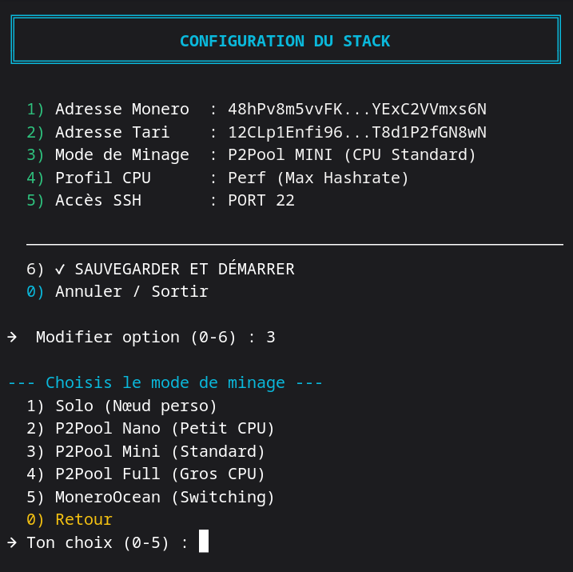

## Lancement :
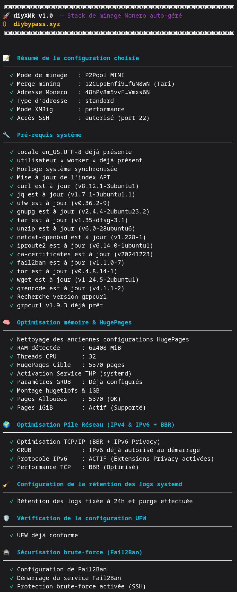
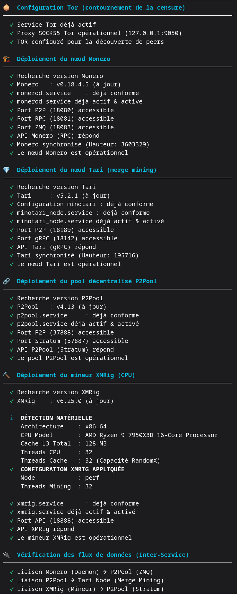
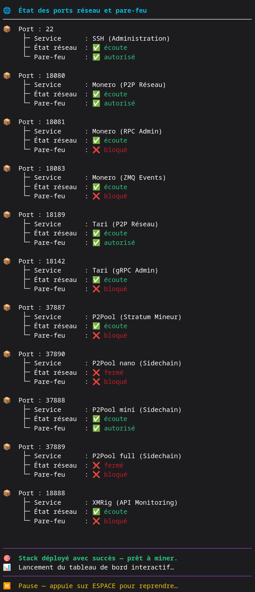

## Menu X (détruire le stack) :
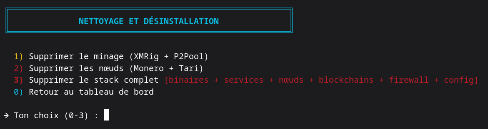

## Menu U (mettre à jour) :
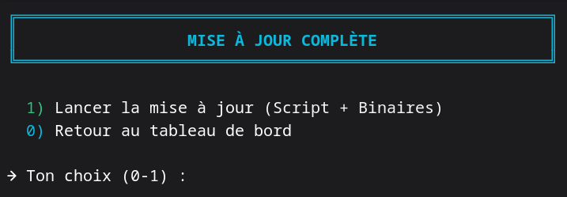

## Menu S (paramètres) :
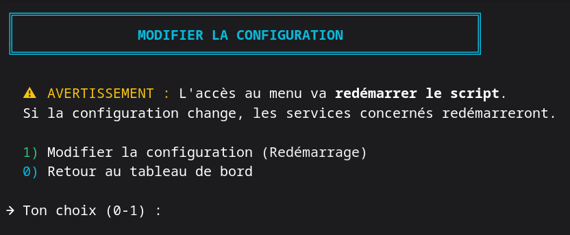

## Menu L (logs) :
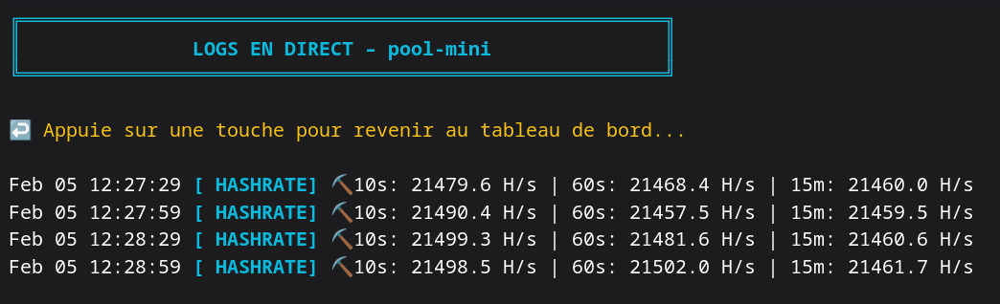

## Menu E (quitter / arrêter) :
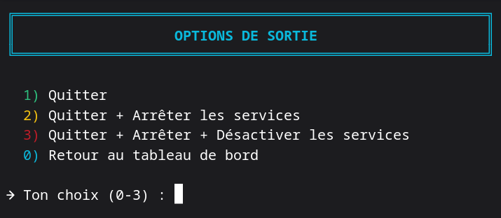

## Menu D (soutenir le projet) :
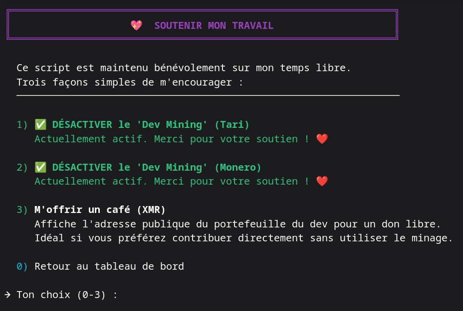
